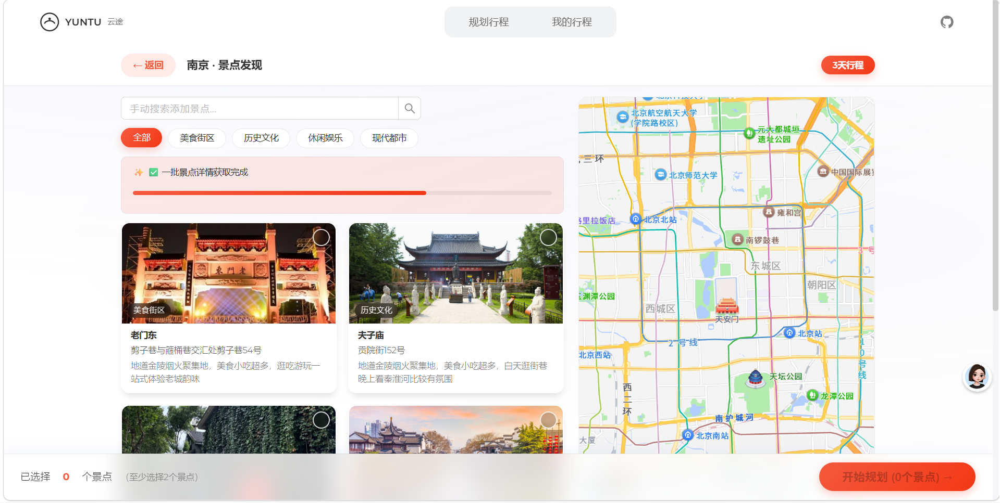
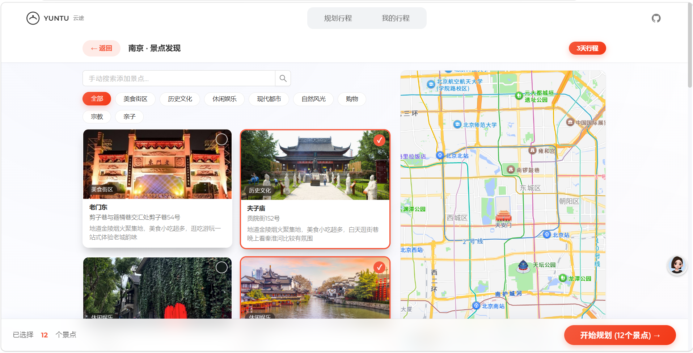
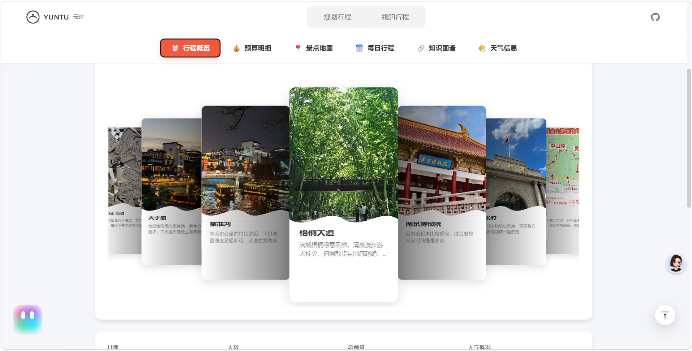
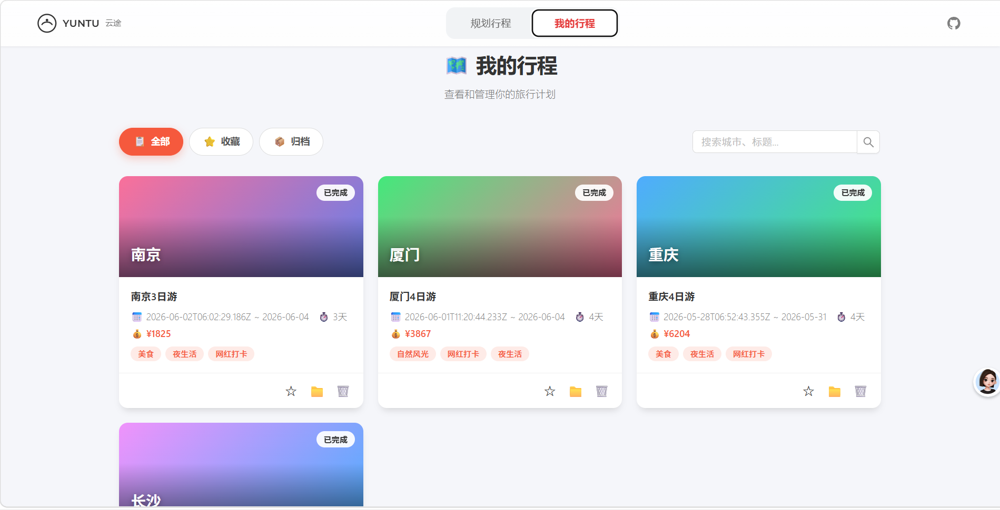

# YUNTU 云途 - AI 智能旅行助手

基于 **LangGraph + FastAPI + Vue 3** 的智能旅行规划系统，支持多城市路线编排、景点智能发现、个性化行程生成。

## 功能特性

- **智能景点发现** — 小红书游记 + 必应搜索 + DuckDuckGo 多源聚合景点信息，高德地图地理编码，分批流式返回供用户选择
- **行程自动规划** — LangGraph 多 Agent 协作：搜索 → 提取 → 地理编码 → 聚类 → 美食推荐 → 路线规划 → 宏观编排 → 单日详情生成
- **多城市路线编排** — 支持跨城市旅行，自动处理城际交通日和城市间日程衔接
- **个性化偏好学习** — 基于用户历史行程自动提取偏好，影响后续推荐（酒店类型、菜系、景点类别等）
- **实时流式反馈** — SSE 流式推送规划进度，每一步节点执行状态实时可见
- **交互式日程编辑** — 拖拽调整景点顺序，手动增减餐饮，草稿暂存与恢复
- **知识图谱可视化** — ECharts 力导向图展示景点、美食、酒店之间的地理关系
- **预算智能分析** — 自动汇总门票、餐饮、住宿、交通各项费用，对比用户预算上限
- **PDF 导出** — 行程结果一键导出为 PDF 文件
- **天气集成** — 高德天气 API + Open-Meteo 双重天气数据源，按季节气候兜底

## 效果展示

### 首页 — 行程规划入口


### 发现页 — 智能景点发现与选择



### 结果页 — 行程详情与多 Tab 展示


### 历史页 — 行程管理与回顾


## 技术栈

### 后端
| 类别 | 技术 |
|------|------|
| 框架 | FastAPI + Uvicorn |
| AI Agent | LangGraph (StateGraph 多节点协作) |
| LLM | LangChain ChatOpenAI（兼容 OpenAI/DeepSeek 等） |
| MCP 工具 | 高德地图 (AMap)、AIGoHotel、必应搜索 |
| 数据库 | SQLAlchemy + SQLite（异步） |
| 搜索 | DuckDuckGo、小红书、必应 MCP |
| 天气 | 高德天气 API + Open-Meteo API |

### 前端
| 类别 | 技术 |
|------|------|
| 框架 | Vue 3 (Composition API + `<script setup>`) |
| UI 库 | Ant Design Vue 4 |
| 路由 | Vue Router 4 |
| 图表 | ECharts 6 + vue-echarts |
| 地图 | 高德地图 JSAPI Loader |
| 构建 | Vite 6 + TypeScript |
| 其他 | html2canvas + jsPDF（导出）、Swiper（轮播）、vuedraggable（拖拽） |

## 项目结构

```
helloagents-trip-planner/
├── backend/
│   ├── run.py                          # 启动入口
│   ├── requirements.txt                # Python 依赖
│   ├── data/                           # 静态数据文件
│   │   ├── city_season_weather.json    # 城市季节气候数据
│   │   └── known_landmarks.json        # 知名地标列表
│   ├── app/
│   │   ├── config.py                   # 配置管理（pydantic-settings）
│   │   ├── database.py                 # 数据库连接与会话管理
│   │   ├── logger.py                   # 日志管理
│   │   ├── api/
│   │   │   ├── main.py                 # FastAPI 应用入口
│   │   │   └── routes/                 # API 路由
│   │   │       ├── trip_lg.py          # 行程规划 (LangGraph)
│   │   │       ├── sse_utils.py        # SSE 流式响应工具
│   │   │       ├── trip_draft.py       # 草稿管理
│   │   │       ├── trip_history.py     # 历史行程
│   │   │       ├── poi_lg.py           # POI 搜索
│   │   │       ├── map_lg.py           # 地图服务
│   │   │       ├── chat.py             # AI 对话
│   │   │       └── admin.py            # 管理后台
│   │   ├── agents/
│   │   │   └── langgraph_agent/        # LangGraph Agent 核心
│   │   │       ├── graph.py            # Graph 定义 + 流式编排
│   │   │       ├── state.py            # State 类型定义
│   │   │       ├── prompts.py          # LLM Prompt 模板
│   │   │       ├── exceptions.py       # 重试策略与异常处理
│   │   │       ├── nodes/              # Graph 节点实现
│   │   │       │   ├── _landmarks.py   # 地标数据加载器
│   │   │       │   ├── search.py       # 景点搜索 + 天气 + 酒店
│   │   │       │   ├── discovery.py    # 景点发现（大量搜索）
│   │   │       │   ├── cluster.py      # 景点聚类
│   │   │       │   ├── food.py         # 美食搜索
│   │   │       │   ├── route.py        # 路线规划
│   │   │       │   ├── generate.py     # 行程生成 + 宏观编排 + 单日详情
│   │   │       │   ├── preferences.py  # 用户偏好提取与保存
│   │   │       │   └── draft.py        # 草稿相关
│   │   │       ├── assemble/           # 组装模块（旧版兼容）
│   │   │       ├── finalize/           # 收尾处理（旧版兼容）
│   │   │       └── utils/              # 工具函数
│   │   │           ├── geo.py          # 地理计算（聚类、距离、坐标提取）
│   │   │           ├── route.py        # 路线计算（高德 API 调用）
│   │   │           └── parsing.py      # JSON 多层容错解析
│   │   ├── models/
│   │   │   ├── schemas.py              # Pydantic 数据模型
│   │   │   ├── db_models.py            # SQLAlchemy ORM 模型
│   │   │   └── state.py                # LangGraph State 模型
│   │   └── services/                   # 外部服务封装
│   │       ├── base_mcp_service.py     # MCP 服务抽象基类
│   │       ├── llm_service.py          # LLM 单例管理
│   │       ├── langchain_amap_tools.py # 高德地图 MCP 工具
│   │       ├── aigohotel_mcp_service.py# 酒店搜索 MCP
│   │       ├── bing_mcp_service.py     # 必应搜索 MCP
│   │       ├── xhs_service.py          # 小红书搜索
│   │       ├── open_meteo_service.py   # Open-Meteo 天气
│   │       ├── unsplash_service.py     # 图片搜索
│   │       ├── knowledge_graph_service.py  # 知识图谱
│   │       ├── preferences_service.py  # 用户偏好
│   │       ├── trip_draft_service.py   # 草稿 CRUD
│   │       ├── trip_history_service.py # 历史行程 CRUD
│   │       ├── chat_service.py         # AI 对话
│   │       └── attractions_cache_service.py # 景点缓存
│   └── tests/                          # 测试
├── frontend/
│   ├── src/
│   │   ├── views/                      # 页面视图
│   │   │   ├── Home.vue                # 首页（表单 + 提交）
│   │   │   ├── DiscoverView.vue        # 景点发现与选择
│   │   │   ├── DraftView.vue           # 草稿编辑
│   │   │   ├── Result.vue              # 行程结果展示
│   │   │   └── MyTrips.vue             # 历史行程
│   │   ├── components/                 # 公共组件
│   │   ├── services/api.ts             # API 调用封装
│   │   ├── styles/                     # 主题样式
│   │   └── types/                      # TypeScript 类型定义
│   ├── package.json
│   └── vite.config.ts
└── .gitignore
```

## 环境变量配置

### 后端 (`backend/.env`)

```env
# LLM 配置（兼容 OpenAI API 格式）
LLM_API_KEY=sk-your-key
LLM_BASE_URL=https://api.openai.com/v1
LLM_MODEL_ID=gpt-4o

# 高德地图 API Key（Web Service）
AMAP_API_KEY=your-amap-key

# AIGoHotel MCP（酒店搜索，通过魔搭社区）
AIGOHOTEL_MCP_URL=https://mcp.api-inference.modelscope.net/xxx/mcp

# 必应搜索 MCP（通过魔搭社区）
BING_MCP_URL=https://mcp.api-inference.modelscope.net/xxx/sse

# 小红书 Cookie（用于游记搜索，可选）
XHS_COOKIE=your-xhs-cookie

# 数据库（默认 SQLite，无需额外配置）
DATABASE_URL=sqlite+aiosqlite:///data/trips.db
```

### 前端 (`frontend/.env`)

```env
# 高德地图 Web JS API Key（用于前端地图渲染）
VITE_AMAP_WEB_JS_KEY=your-amap-web-key
```

## 快速开始

### 环境要求

- Python 3.10+
- Node.js 18+
- npm 或 yarn

### 后端启动

```bash
cd backend

# 创建虚拟环境
python -m venv venv
source venv/bin/activate  # Windows: venv\Scripts\activate

# 安装依赖
pip install -r requirements.txt

# 配置环境变量
cp .env.example .env
# 编辑 .env 填入你的 API Key

# 启动服务（默认 http://localhost:8000）
python run.py
```

### 前端启动

```bash
cd frontend

# 安装依赖
npm install

# 配置环境变量
cp .env.example .env
# 编辑 .env 填入高德地图 Web JS API Key

# 启动开发服务器（默认 http://localhost:5173）
npm run dev
```

### API 文档

启动后端后访问：
- Swagger UI: http://localhost:8000/docs
- ReDoc: http://localhost:8000/redoc

## 核心工作流

```
用户请求 → LangGraph Agent 流水线：
  ┌─────────────┐    ┌──────────────┐    ┌─────────────┐
  │ 景点搜索     │ →  │ 景点提取      │ →  │ 地理编码     │
  │ (多源聚合)   │    │ (LLM 纯化)   │    │ (高德 API)   │
  └─────────────┘    └──────────────┘    └─────────────┘
                                               │
  ┌─────────────┐    ┌──────────────┐    ┌─────────────┐
  │ 天气查询     │    │ 酒店搜索      │    │ 搜索结果汇总 │
  │ (并行执行)   │    │ (并行执行)    │ ←  │             │
  └─────────────┘    └──────────────┘    └─────────────┘
                                               │
  ┌─────────────┐    ┌──────────────┐    ┌─────────────┐
  │ 路线规划     │ ←  │ 美食搜索      │ ←  │ 景点聚类     │
  └─────────────┘    └──────────────┘    └─────────────┘
                                               │
  ┌─────────────┐    ┌──────────────┐    ┌─────────────┐
  │ 并行单日详情 │ ←  │ 宏观行程骨架  │    │   ...        │
  │ (每日子图)   │    │              │    │             │
  └─────────────┘    └──────────────┘    └─────────────┘
         │
  ┌─────────────┐    ┌──────────────┐    ┌─────────────┐
  │ 全局建议生成  │ ←  │ 归约合并      │    │ 偏好提取保存 │
  └─────────────┘    └──────────────┘    └─────────────┘
```

## License

MIT
